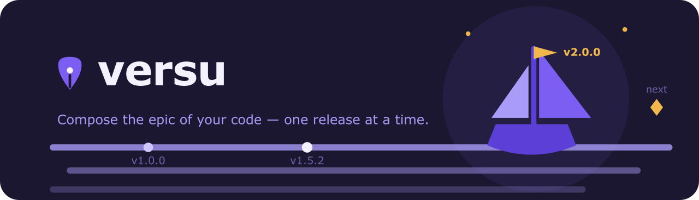

<!-- markdownlint-disable MD041 -->



<!-- markdownlint-enable MD041 -->

# @versu/plugin-node - Node.js Adapter Plugin

Node.js adapter plugin for Versu. Provides support for detecting and updating versions in Node.js projects, including npm, yarn and pnpm workspace monorepos.

## Installation

```bash
npm install @versu/core @versu/plugin-node
```

## Usage

```typescript
import { VersuRunner } from '@versu/core';
import nodePlugin from '@versu/plugin-node';

const runner = new VersuRunner({
  repoRoot: '/path/to/repository',
  plugins: [nodePlugin],
  adapter: 'node', // Optional - auto-detected
  // ...other options as needed
});

const result = await runner.run();
```

## Auto-Detection

The plugin automatically activates when `package.json` is present in the repository root.

## Workspace Support

Workspace members are discovered from:

- the `workspaces` field of the root `package.json` (npm / yarn, array or `{ packages: [] }` form), or
- `pnpm-workspace.yaml` (`packages` globs) when the root `package.json` declares no workspaces.

Projects without workspaces are handled as a single root module.

Dependencies between workspace packages (`dependencies`, `devDependencies`, `peerDependencies`, `optionalDependencies`) are used to build the dependency cascade: bumping a package also affects the packages that depend on it.

## Notes

- Module IDs follow Gradle-style notation (e.g., `:` for root, `:packages:core`).
- The plugin updates:
  - the `version` field of a module's `package.json` when the module declares a version.
  - internal dependency ranges pointing at renumbered workspace packages, preserving the range operator and the `workspace:` protocol (e.g. `^1.2.3` → `^2.0.0`, `workspace:~1.2.3` → `workspace:~2.0.0`).
- Specs without a concrete version are left untouched: `*`, `workspace:*`, `workspace:^`, `workspace:~`, `file:`, `link:`, git/url specs and compound ranges.
